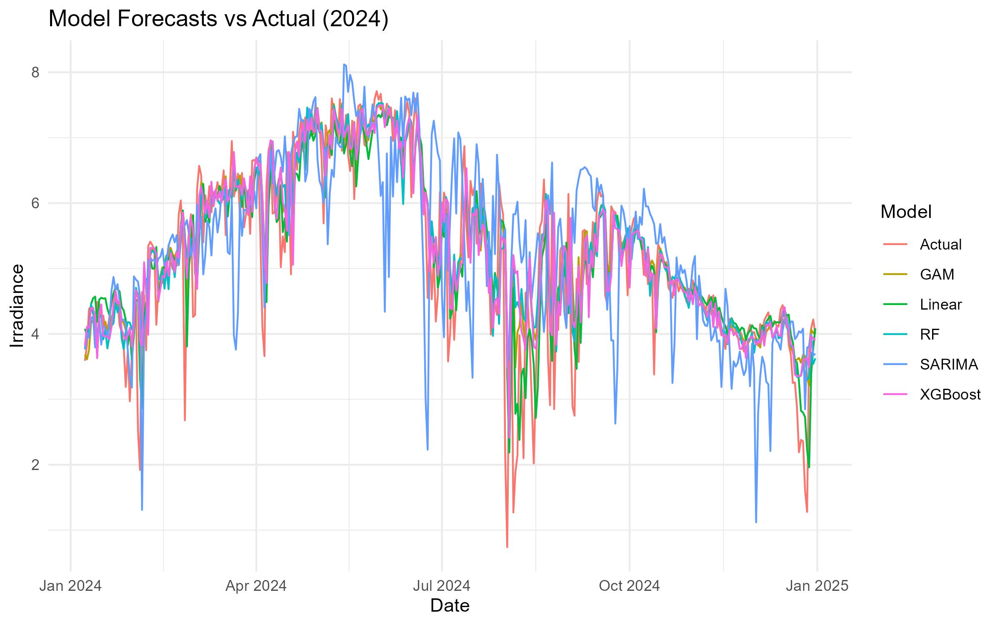

# Solar Irradiance Forecasting using NASA POWER API

This project builds a modular R pipeline to forecast solar energy potential using daily solar irradiance data from 2013–2023. Five forecasting models were compared to identify the most accurate approach.

##  Tools Used
- R: tidyverse, forecast, caret, xgboost
- NASA POWER API
- ggplot2, dplyr

## Workflow
1. Data extraction from NASA POWER API
2. Cleaning, feature engineering (lags, rolling stats)
3. Model training: Linear Regression, XGBoost, GAM, SARIMA, Random Forest
4. Evaluation using RMSE and MAE
5. Visualization of future predictions

1. Retrieved historical solar irradiance data via **NASA POWER API**  
2. Performed data wrangling and **feature engineering** (lags, rolling stats, interactions)  
3. Trained and compared five forecasting models:  
   - **Statistical**: Linear Regression, GAM, SARIMA  
   - **ML-based**: Random Forest, XGBoost  
4. Evaluated model performance using **RMSE, MAE**, and **visual diagnostics**  
5. Created future irradiance forecasts for insight into predictability

## Sample Output

## Files
- `/scripts/forecasting_models.R`: Full forecasting pipeline
- `/plots/`: Forecast visualizations
